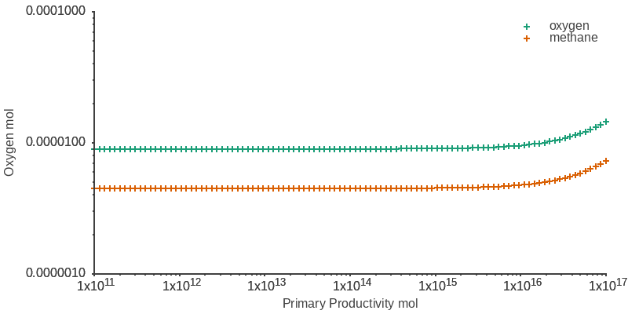

# CPPND: Capstone Project: A model of the Great Oxidation Event

This is my capstone project for the [Udacity C++ Nanodegree Program](https://www.udacity.com/course/c-plus-plus-nanodegree--nd213). For this project I decided to build a model of the Great Oxidation Event following the equations described in [Goldblatt et. al 2006](https://www.nature.com/articles/nature05169#:~:text=The%20bistability%20arises%20because%20ultraviolet,the%20lifetime%20of%20atmospheric%20oxygen.).

## The model

The Great Oxidation Event was one of the most important transitions in Earth's history because it marked the start of significant oxygen accumulation in the atmosphere. [Goldblatt et. al 2006](https://www.nature.com/articles/nature05169#:~:text=The%20bistability%20arises%20because%20ultraviolet,the%20lifetime%20of%20atmospheric%20oxygen.) constructed a model to try to undertand what caused this transition. According to this model, the transition was caused by a bistability in atmospheric oxygen that provoked a rapid accumulation of oxygen during the Great oxidation Event. The model consists of the following equations:

1. M' = 1/2 &Omega;(O2) (1 - &beta;) (N + r) + 1/2 &Omega;(O2)wC - sM - 1/2 &Psi;(O2) M0.7

2. O' = &Omega;(O2)N - (1 - &Omega;(O2))r + &beta;(1 - &Omega;(O2))(N + r) - (1 - &Omega;(O2))wC - sM - &Psi;(O2) M0.7

3. C' = &beta; (N + r ) - wC

Where:

- M' is the rate of change of methane in the surface
- O' is the rate of change of oxygen in the surface
- C' is the rate of change of organic carbon in the crust
- &Omega;(O2) is the fraction of the organic carbon available to decomposers
- &beta; is the fraction,of the available organic carbon in the surface ocean buried in sediments
- N is the primary productivity
- r is the reductant input from the mantle
- w is rate of exposure of buried organic carbon from the crust
- s is the hydrogen escape coefficient
- &Psi;(O2) is a parametrization of the oxidation of methane in the atmosphere as a function of the oxygen concentration

The details and derivation of these equation can be consulted in the supplementary information of [Goldblatt et. al 2006](https://www.nature.com/articles/nature05169#:~:text=The%20bistability%20arises%20because%20ultraviolet,the%20lifetime%20of%20atmospheric%20oxygen.). This papaer solves the steady states of these equation assuming that the derivatives are zero. In this project I try to solve the model without assuming steady state, solving the differential equations.

## Structure of the project

The source code og this project has the following structure

	📦src
	 ┣ 📜DynamicModel.cpp
	 ┣ 📜DynamicModel.h
	 ┣ 📜FinalStates.cpp
	 ┣ 📜FinalStates.h
	 ┣ 📜main.cpp
	 ┗ 📜utils.h
	 
- `DynamicModel.h` and `DynamicModel.cpp` define and implement the DynamicModel class. This class contains all the necessary methods and properties to solve the equations described above. The DynamicModel::FindFinalStates() method is the responsible for solving the model using a forward Euler approach.
- `FinalStates.h` and `FinalStates.cpp` define and implement the FinalStates class. This class runs the DynamicModel class for several primary productivity values and stores the results. Also this class contains a method for plotting the results and generating a gif.
- `utils.h` contains helper functions useful for solving the model.
- `main.cpp` creates a final_states object and class the plot method to plot the results of the model.

## Expected behavior and output of the program

After building and running the program, the results of the calculations will be printed in the terminal. When the program finishes there will be a plot.gif file in the build directory similar to the one showed above. This plot shows the results of solving the model for the parameters used in `main.cpp`. The program will also create a plot/ directory that contains all the plots generated.

## Interpretation of the results

The gif generated by the program shows the time evolution of the model. You cas see how an instability zone in oxygen and methane develops with time.

## Dependencies for Running Locally
* [sciplot](https://github.com/sciplot/sciplot)
	* We use sciplot as a submodule of this project. Sciplot will be downlowaded by cmake when you build the project
* [gnuplot](http://www.gnuplot.info/): Ssciplot uses gnuplot, so it is necessary to install it to run this project. 
	* To install gnuplot on linux run: `sudo apt-get install -y gnuplot`
	* To install gnuplot on windows follow [this link](http://spiff.rit.edu/classes/ast601/gnuplot/install_windows.html).
	* To install gnuplot in mac run `brew install gnuplot`
* [ImageMagick](https://imagemagick.org/index.php): This project uses ImageMagick to create the gif of the results.
	* You can download ImageMagic for linux, windows or mac [here](https://imagemagick.org/script/download.php)
	
* cmake >= 3.7
  * All OSes: [click here for installation instructions](https://cmake.org/install/)
* make >= 4.1 (Linux, Mac), 3.81 (Windows)
  * Linux: make is installed by default on most Linux distros
  * Mac: [install Xcode command line tools to get make](https://developer.apple.com/xcode/features/)
  * Windows: [Click here for installation instructions](http://gnuwin32.sourceforge.net/packages/make.htm)
* gcc/g++ >= 5.4
  * Linux: gcc / g++ is installed by default on most Linux distros
  * Mac: same deal as make - [install Xcode command line tools](https://developer.apple.com/xcode/features/)
  * Windows: recommend using [MinGW](http://www.mingw.org/)

## Basic Build Instructions

1. Clone this repo.
2. Make a build directory in the top level directory: `mkdir build && cd build`
3. Compile: `cmake .. && make`
4. Run it: `./modelGOE`.

## Rubric points addressed 

Apart from the README and Compiling and Testing criteria, this project addressed the following criteria from the [project rubric](https://review.udacity.com/#!/rubrics/2533/view):

1. __The project demonstrates an understanding of C++ functions and control structures.__ The `utils.h` file uses functions and control strcutures.

2. __The project uses Object Oriented Programming techniques.__ The `DynamicModel.cpp` and `FinalStates.cpp` files contain classes.

3. __Classes use appropriate access specifiers for class members.__ The `DynamicModel.cpp` and `FinalStates.cpp` files contain public and private access specifiers.

4. __Classes encapsulate behavior.__ The `DynamicModel.cpp` and `FinalStates.cpp` files contain deffinitions of getters and setters.

5. __Templates generalize functions in the project.__ The `utils.h` file uses a template in line 10 to create a function. 

Thus, this project satisfies at least 5 total criteria from the rest of the rubric. 

